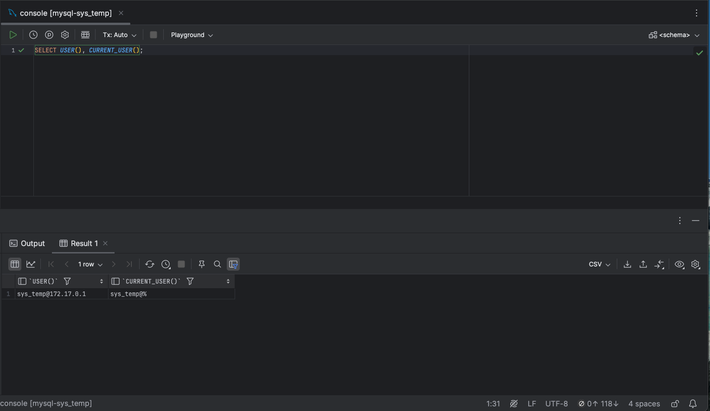
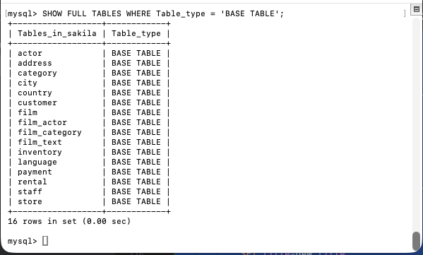
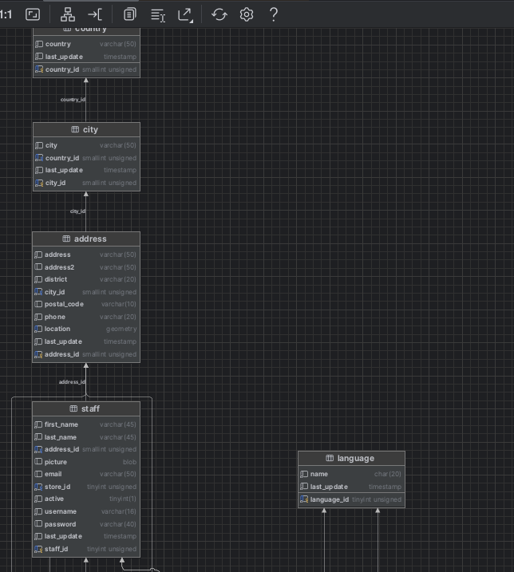
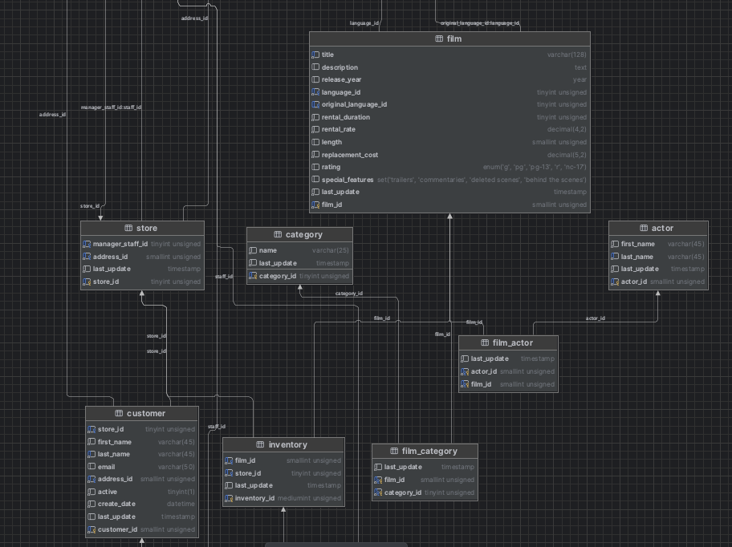
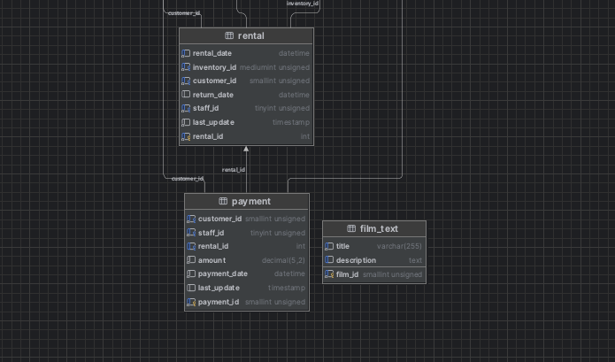
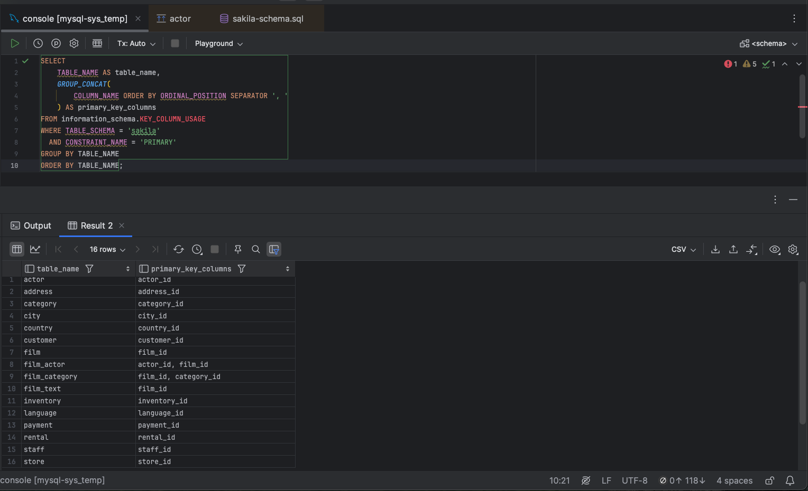

# Домашнее задание к занятию «Работа с данными (DDL/DML)» — Сергеев Александр

## Задание 1

### 1.1. Запуск MySQL

MySQL развёрнут в Docker. Установленная версия — 8.0.46.

Команда запуска контейнера:

```bash
docker run --name mysql-homework \
  -e MYSQL_ROOT_PASSWORD=RootPass123 \
  -p 127.0.0.1:3306:3306 \
  -v mysql_homework_data:/var/lib/mysql \
  -d mysql:8.0
```

Для работы с базой данных используется DataGrip.

### 1.2. Создание пользователя sys_temp

Под пользователем `root` выполнен запрос:

```sql
CREATE USER 'sys_temp'@'%' IDENTIFIED BY 'TempPass123';
```

### 1.3. Получение списка пользователей

```sql
SELECT User, Host, plugin
FROM mysql.user
ORDER BY User, Host;
```


### 1.4. Выдача прав пользователю sys_temp

```sql
GRANT ALL PRIVILEGES ON *.* TO 'sys_temp'@'%';
```

### 1.5. Получение списка прав пользователя sys_temp

```sql
SHOW GRANTS FOR 'sys_temp'@'%';
```


### 1.6. Подключение под пользователем sys_temp

В DataGrip создано подключение к MySQL под пользователем `sys_temp`.

Проверка текущего пользователя:

```sql
SELECT USER(), CURRENT_USER();
```

Значение `CURRENT_USER()` — `sys_temp@%`.



### 1.7. Восстановление базы данных Sakila

Скачан и распакован архив с дампом базы данных Sakila.

SQL-файлы скопированы в контейнер:

```bash
docker cp ~/Downloads/sakila-db/sakila-schema.sql mysql-homework:/tmp/sakila-schema.sql
docker cp ~/Downloads/sakila-db/sakila-data.sql mysql-homework:/tmp/sakila-data.sql
```

Выполнено подключение через клиент MySQL под пользователем `sys_temp`:

```bash
docker exec -it mysql-homework mysql -h 127.0.0.1 -u sys_temp -p
```

Последовательно выполнены скрипты создания схемы и загрузки данных:

```sql
SOURCE /tmp/sakila-schema.sql;
SOURCE /tmp/sakila-data.sql;
```

### 1.8. Получение списка таблиц

В командной строке выполнен запрос:

```sql
USE sakila;
SHOW FULL TABLES WHERE Table_type = 'BASE TABLE';
```

База данных `sakila` содержит 16 таблиц.






## Задание 2

Первичные ключи таблиц базы данных `sakila`:

| Таблица | Столбцы первичного ключа |
|---|---|
| actor | actor_id |
| address | address_id |
| category | category_id |
| city | city_id |
| country | country_id |
| customer | customer_id |
| film | film_id |
| film_actor | actor_id, film_id |
| film_category | film_id, category_id |
| film_text | film_id |
| inventory | inventory_id |
| language | language_id |
| payment | payment_id |
| rental | rental_id |
| staff | staff_id |
| store | store_id |

В таблицах `film_actor` и `film_category` первичные ключи составные: каждый состоит из двух столбцов.

