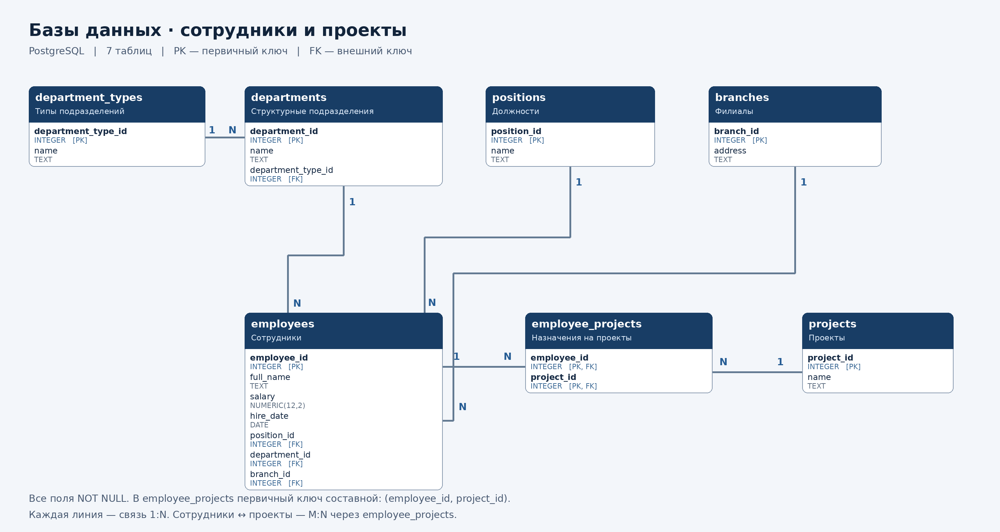

# Домашнее задание к занятию «Базы данных» — Сергеев Александр

## Задание 1

На основе исходного Excel-отчёта спроектирована база данных из семи таблиц:

1. Типы подразделений.
2. Структурные подразделения.
3. Должности.
4. Филиалы.
5. Сотрудники.
6. Проекты.
7. Назначения сотрудников на проекты.

### Таблицы и типы данных

Обозначения:

- **PK** — первичный ключ.
- **FK** — внешний ключ.

Все столбцы обязательны для заполнения (`NOT NULL`). Идентификаторы сотрудников и справочников генерируются автоматически с помощью `GENERATED ALWAYS AS IDENTITY`.

#### 1. department_types — Типы подразделений

Хранит типы подразделений: группа, отдел, департамент.

| Столбец | Тип PostgreSQL | Назначение | Ключ |
|---|---|---|---|
| department_type_id | INTEGER | Идентификатор типа подразделения | PK |
| name | TEXT | Название типа подразделения | — |

#### 2. departments — Структурные подразделения

Хранит названия подразделений и ссылки на их типы.

| Столбец | Тип PostgreSQL | Назначение | Ключ |
|---|---|---|---|
| department_id | INTEGER | Идентификатор подразделения | PK |
| name | TEXT | Название подразделения | — |
| department_type_id | INTEGER | Ссылка на department_types | FK |

#### 3. positions — Должности

Хранит перечень должностей сотрудников.

| Столбец | Тип PostgreSQL | Назначение | Ключ |
|---|---|---|---|
| position_id | INTEGER | Идентификатор должности | PK |
| name | TEXT | Название должности | — |

#### 4. branches — Филиалы

Хранит сведения об адресах филиалов.

| Столбец | Тип PostgreSQL | Назначение | Ключ |
|---|---|---|---|
| branch_id | INTEGER | Идентификатор филиала | PK |
| address | TEXT | Адрес филиала | — |

#### 5. employees — Сотрудники

Хранит ФИО сотрудника, оклад, дату найма и ссылки на должность, подразделение и филиал.

| Столбец | Тип PostgreSQL | Назначение | Ключ |
|---|---|---|---|
| employee_id | INTEGER | Идентификатор сотрудника | PK |
| full_name | TEXT | ФИО сотрудника | — |
| salary | NUMERIC(12,2) | Оклад сотрудника | — |
| hire_date | DATE | Дата найма | — |
| position_id | INTEGER | Ссылка на positions | FK |
| department_id | INTEGER | Ссылка на departments | FK |
| branch_id | INTEGER | Ссылка на branches | FK |

Для оклада задаётся ограничение `CHECK (salary >= 0)`.

#### 6. projects — Проекты

Хранит перечень проектов, на которые назначены сотрудники.

| Столбец | Тип PostgreSQL | Назначение | Ключ |
|---|---|---|---|
| project_id | INTEGER | Идентификатор проекта | PK |
| name | TEXT | Название проекта | — |

#### 7. employee_projects — Назначения сотрудников на проекты

Связывает сотрудников с проектами.

| Столбец | Тип PostgreSQL | Назначение | Ключ |
|---|---|---|---|
| employee_id | INTEGER | Ссылка на employees | PK, FK |
| project_id | INTEGER | Ссылка на projects | PK, FK |

Первичный ключ составной: `(employee_id, project_id)`. Он запрещает повторное назначение одного сотрудника на один проект.

### Связи между таблицами

| Родительская таблица | Дочерняя таблица | Внешний ключ | Тип связи |
|---|---|---|---|
| department_types | departments | department_type_id | Один ко многим |
| departments | employees | department_id | Один ко многим |
| positions | employees | position_id | Один ко многим |
| branches | employees | branch_id | Один ко многим |
| employees | employee_projects | employee_id | Один ко многим |
| projects | employee_projects | project_id | Один ко многим |

Между сотрудниками и проектами существует связь **многие ко многим**: один сотрудник может участвовать в нескольких проектах, а в одном проекте могут участвовать несколько сотрудников. Эта связь реализована через таблицу `employee_projects`.

Каждая дочерняя запись ссылается на одну родительскую запись. Родительская запись может не иметь дочерних записей.

### Обоснование модели

- Повторяющиеся должности, подразделения, типы подразделений, филиалы и проекты вынесены в отдельные таблицы.
- Оклад хранится у сотрудника, поскольку в исходном отчёте сотрудники с одинаковой должностью имеют разные оклады.
- Для оклада используется точный числовой тип `NUMERIC(12,2)`, позволяющий хранить два знака после запятой.
- ФИО хранится в поле `TEXT` и не используется как первичный ключ, поскольку у разных сотрудников ФИО может совпадать.
- Подразделение и филиал связаны с сотрудником независимо: в отчёте сотрудники одного подразделения встречаются по разным адресам филиалов.
- Несколько проектов из одной ячейки Excel сохраняются отдельными записями в `projects`, а назначения — в `employee_projects`.
- Для даты найма используется тип `DATE`. Принято допущение, что исходные числа записаны в формате ДДММГГ с возможным отсутствием ведущего нуля: например, `10313` соответствует `01.03.2013`.
- Модель отражает текущие сведения из отчёта. История изменения оклада, должности и назначений не моделируется.

### Схема модели данных

На схеме показаны все таблицы, столбцы, типы PostgreSQL, первичные и внешние ключи, а также связи между таблицами.

